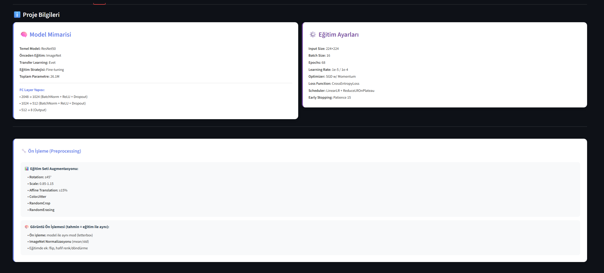
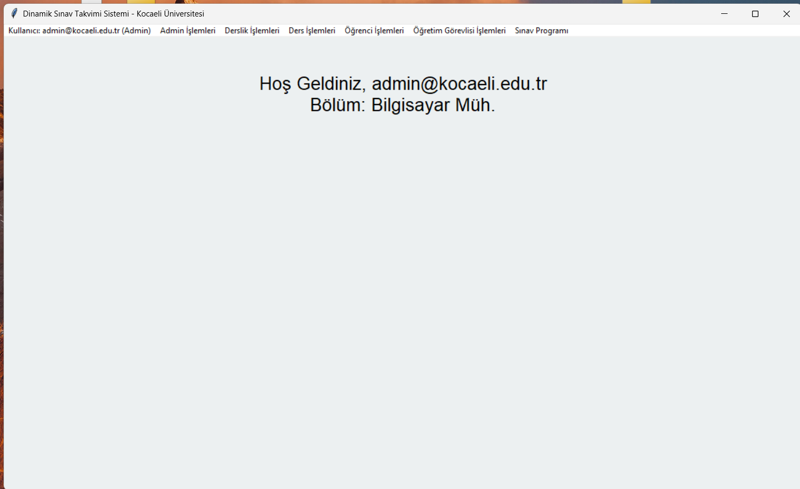

# Sınav Oturma Planı Sistemi

Üniversite bölümleri için sınav takvimi oluşturma ve otomatik oturma planı (yerleşim düzeni) hazırlama amaçlı masaüstü uygulaması.



Admin girişi sonrası ana panel — bölüm, derslik, ders, öğrenci, öğretim görevlisi ve sınav programı işlemleri üst menüden yönetilir:



## Özellikler

- Rol tabanlı giriş (Admin / Bölüm Koordinatörü)
- Bölüm, derslik ve ders yönetimi
- Sınav programı oluşturma
- Derslik kapasitesine göre otomatik oturma planı üretimi
- Oturma planının PDF olarak dışa aktarımı (ReportLab)
- Excel'e aktarım (pandas)

## Teknoloji

- Python, Tkinter (arayüz)
- MySQL (veritabanı)
- pandas, Pillow, ReportLab

## Kurulum

```bash
pip install -r requirements.txt
```

MySQL'de bir kullanıcı/şifre oluşturup aşağıdaki ortam değişkenlerini ayarlayın (ayarlanmazsa `root` / boş şifre / `localhost` ile bağlanmayı dener):

```bash
set DB_HOST=localhost
set DB_USER=root
set DB_PASSWORD=your_password
set DB_NAME=sinav_takvimi_db
```

Ardından çalıştırın:

```bash
python sinav_oturma_plani.py
```

Veritabanı ve tablolar (`kullanicilar`, `bolumler`, `derslikler`, `dersler`, `sinav_programi`, `oturma_plani`) ilk çalıştırmada otomatik oluşturulur.

## Exe olarak paketleme

```bash
pyinstaller sinav_oturma_plani.spec
```
