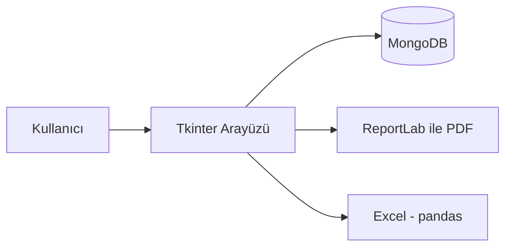

# Sınav Oturma Planı Sistemi

Üniversite bölümleri için sınav takvimi oluşturma ve otomatik oturma planı (yerleşim düzeni) hazırlama amaçlı masaüstü uygulaması.

Giriş ekranı — pencereyle birlikte ölçeklenen arka plan, şifre göster/gizle ve kayıt bağlantısı:


Admin girişi sonrası ana panel — özet kartları, hızlı işlemler ve yaklaşan sınavlar; tüm veri işlemleri üst menüden yönetilir:


## Mimari



## Özellikler

- Rol tabanlı giriş (Admin / Bölüm Koordinatörü) ve kendi kendine kayıt olma
- Ana panelde özet istatistik kartları, hızlı işlem kısayolları ve yaklaşan sınav listesi
- Bölüm, derslik ve ders yönetimi
- Sınav programı oluşturma (öğrenci çakışmalarını otomatik olarak önlemeye çalışan yerleştirme algoritması)
- Sınav takviminin derslik x zaman ızgarası olarak genel görünümü
- Derslik kapasitesine ve sıra yapısına (2'li, 3'lü, 4'lü... herhangi bir N'li sıra) göre otomatik, anti-kopya boşluklu oturma planı üretimi
- Oturma planında öğrencilerin koltuğuna tıklayıp başka bir koltukla yer değiştirme (manuel düzeltme)
- Sınavlara gözetmen (öğretim görevlisi) atama
- Oluşturulmuş sınav programı için çakışma raporu (aynı öğrencinin üst üste binen sınavları var mı denetimi)
- Oturma planı listesinde öğrenci no / ad soyad ile canlı arama
- Öğrencilere sınav yeri/saati bilgisini e-posta ile toplu gönderme
- Öğrenci/ders Excel şablonu indirme ve büyük dosyaların arayüzü kilitlemeden (arka planda, ilerleme çubuklu) yüklenmesi
- Kim ne zaman ne yaptı kaydı (aktivite log) — Admin, "Aktivite Kaydı" ekranından izleyebilir
- Oturma planının PDF olarak dışa aktarımı (ReportLab)
- Excel'e aktarım (pandas)

## Güvenlik

- Şifreler bcrypt ile hash'lenir; önceden salt'sız SHA256 ile oluşturulmuş hesaplar bir sonraki başarılı girişte otomatik olarak bcrypt'e yükseltilir.
- Giriş ekranından kayıt olan hesaplar her zaman "Bölüm Koordinatörü" rolüyle açılır; Admin yetkisi yalnızca mevcut bir Admin tarafından "Yeni Kullanıcı Ekle" ekranından verilebilir.
- Varsayılan admin hesabı bilgileri `ADMIN_EMAIL` / `ADMIN_PASSWORD` ortam değişkenleri ile özelleştirilebilir (aşağıya bakın). Ayarlanmazsa `admin@kocaeli.edu.tr` / `admin123` kullanılır — **ilk girişten sonra bu şifreyi değiştirmeniz önerilir.**

## E-posta Bildirimi

Öğrencilere sınav yeri/saati bildirimi göndermek için herhangi bir SMTP sunucusu (Gmail uygulama şifresi, okulunuzun mail sunucusu, Outlook vb.) kullanılabilir; sağlayıcıya özel bir bağımlılık yoktur. Aşağıdaki ortam değişkenleri ayarlanmadan bu özellik kullanılamaz — buton "SMTP Yapılandırılmamış" hatası gösterir, sessizce başarısız olmaz:

```bash
set SMTP_HOST=smtp.gmail.com
set SMTP_PORT=587
set SMTP_USER=your_account@gmail.com
set SMTP_PASSWORD=your_app_password
```

Bildirim, öğrencinin `Öğrenci Düzenle`/`Öğrenci Ekle` ekranında veya Excel yüklemesinde ("E-posta" sütunu) girilmiş bir e-postası varsa, oturma planı ekranındaki "📧 Bildirim Gönder" butonuyla gönderilir.

## Teknoloji

- Python, Tkinter (arayüz)
- MongoDB (veritabanı, pymongo sürücüsü ile)
- pandas, openpyxl, Pillow, ReportLab, bcrypt
- smtplib (Python standart kütüphanesi) — e-posta bildirimi

## Proje Yapısı

Uygulama, tek bir dev dosya yerine sorumluluklarına göre ayrılmış bir pakettir:

```
main.py                        # Başlangıç noktası (python main.py)
sinav_oturma_plani/
    styles.py                  # Renk paleti, ttk stilleri, ikon üretimi, şifre hashleme
    database.py                # MongoDB bağlantısı, koleksiyon/index kurulumu, varsayılan admin
    cascades.py                 # Cascade delete/set-null yardımcıları (MongoDB'de FK yok)
    notifications.py           # SMTP e-posta gönderimi (sağlayıcıdan bağımsız)
    app.py                     # SinavTakvimiApp: tüm ekran mixin'lerini + arka plan görev
                                # (threading/ilerleme çubuğu) yardımcısını birleştirir
    ui/
        auth.py                 # Giriş, kullanıcı ekleme, bölüm seçimi
        dashboard.py             # Ana menü, özet istatistik kartları, aktivite kaydı ekranı
        instructors.py           # Öğretim görevlisi işlemleri
        classrooms.py            # Derslik işlemleri
        courses.py               # Ders işlemleri (+ Excel şablonu)
        students.py              # Öğrenci işlemleri (+ Excel şablonu)
        scheduler.py             # Sınav programı oluşturma, çakışma raporu, genel takvim
        seating.py               # Oturma planı (tıkla-değiştir dahil), gözetmen atama,
                                  # e-posta bildirimi, PDF/Excel export
```

Her `ui/*.py` dosyası, `SinavTakvimiApp` sınıfına çoklu kalıtımla (mixin) eklenen bir sınıf tanımlar; bu sayede ekranlar arasında `self.current_bolum`, `self.db` gibi ortak durum paylaşılırken kod tek bir dosyada birikmez. Yeni bir ekran eklerken ilgili domain dosyasına bir metot eklemeniz ve `app.py`'deki mixin listesine (zaten varsa) dokunmadan `sinav_menu`/`ogrenci_menu` gibi menüye bağlamanız yeterli.

## Kurulum

> Bu bir Tkinter masaüstü uygulamasıdır; grafik arayüzü nedeniyle Docker ile çalıştırmak pratik değildir, aşağıdaki adımlarla doğrudan çalıştırın.

```bash
pip install -r requirements.txt
```

MongoDB'nin yerelde (veya erişilebilir bir sunucuda) çalışıyor olması yeterlidir; kullanıcı/şifre gerekmez. İsteğe bağlı olarak bağlantı adresini ve veritabanı adını ortam değişkenleriyle özelleştirebilirsiniz (ayarlanmazsa `mongodb://localhost:27017` / `sinav_takvimi_db` kullanılır):

```bash
set MONGO_URI=mongodb://localhost:27017
set MONGO_DB_NAME=sinav_takvimi_db
```

İsteğe bağlı olarak varsayılan admin hesabının bilgilerini de özelleştirebilirsiniz (ayarlanmazsa `admin@kocaeli.edu.tr` / `admin123` kullanılır):

```bash
set ADMIN_EMAIL=admin@example.edu.tr
set ADMIN_PASSWORD=your_secure_password
```

E-posta bildirimi göndermek istiyorsanız `SMTP_*` ortam değişkenlerini de ayarlayın (bkz. "E-posta Bildirimi" bölümü); ayarlanmazsa bildirim gönderme butonu net bir hata gösterir, uygulamanın geri kalanı normal çalışmaya devam eder.

Ardından çalıştırın:

```bash
python main.py
```

Veritabanı ve koleksiyonlar (`kullanicilar`, `bolumler`, `derslikler`, `dersler`, `sinav_programi`, `oturma_plani`, `aktivite_log` ve diğerleri) ile gerekli unique index'ler ilk çalıştırmada otomatik oluşturulur.

## Exe olarak paketleme

```bash
pyinstaller sinav_oturma_plani.spec
```
