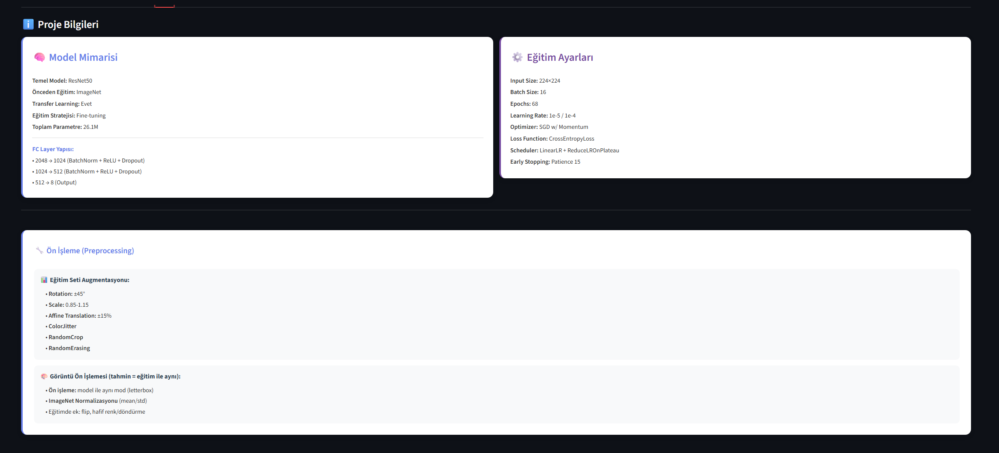
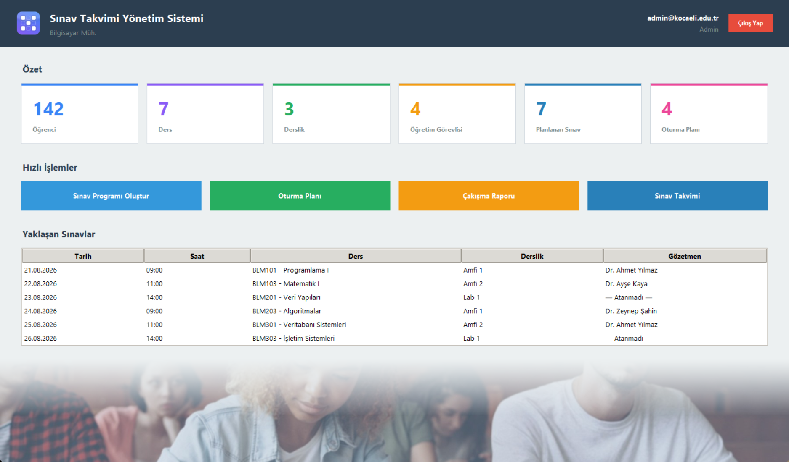
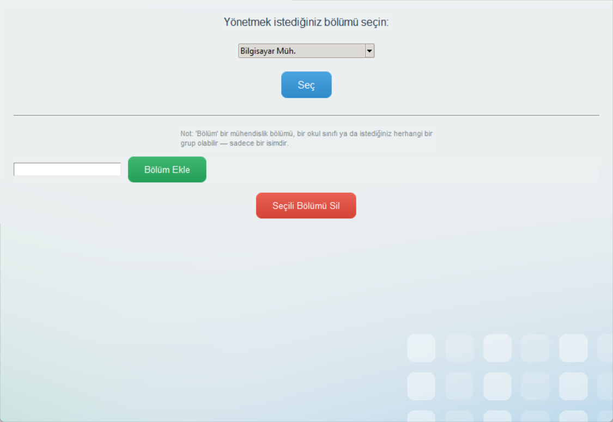

# Sınav Oturma Planı Sistemi

Üniversite bölümleri için sınav programı hazırlayan ve sınavlara göre oturma planı çıkaran masaüstü uygulaması. Python Tkinter ile yapıldı, veriler MongoDB'de duruyor.

Giriş ekranı:



Admin girişinden sonra ana panel (özet kartları, kısayollar, yaklaşan sınavlar):



Alt ekranlar da aynı temayı kullanıyor:



## Neler var

- Admin ve Bölüm Koordinatörü olarak giriş, kayıt olma
- Bölüm, derslik ve ders yönetimi, öğretim görevlisi işlemleri
- Sınav programı oluşturma: aynı öğrencinin sınavlarının çakışmaması için yerleştirme yapılıyor, sonrasında çakışma raporu alınabiliyor
- Sınav takvimini derslik ve saat tablosu olarak görme
- Derslik kapasitesine ve sıra düzenine (2'li, 3'lü, 4'lü sıralar) göre, kopyayı zorlaştıran boşluklarla otomatik oturma planı
- Oturma planında bir öğrencinin koltuğuna tıklayıp başka koltukla yer değiştirme, öğrenci no ya da isimle arama
- Sınavlara gözetmen atama
- Öğrenci ve ders listelerini Excel'den yükleme (şablon indirilebiliyor, büyük dosyalar arka planda yükleniyor)
- Oturma planını PDF ya da Excel olarak dışarı aktarma
- Öğrencilere sınav yerini ve saatini e-posta ile toplu gönderme
- Kimin ne yaptığını gösteren aktivite kaydı (Admin görebiliyor)

Şifreler bcrypt ile saklanıyor. Giriş ekranından kayıt olanlar her zaman Bölüm Koordinatörü oluyor, Admin yetkisini sadece mevcut bir Admin verebiliyor.

## Kullanılanlar

Python, Tkinter, MongoDB (pymongo), pandas, openpyxl, Pillow, ReportLab, bcrypt, smtplib

## Çalıştırma

MongoDB'nin açık olması yeterli (şifre gerekmiyor).

```
pip install -r requirements.txt
python main.py
```

Ayarlar ortam değişkenleriyle değiştirilebiliyor, hiçbiri zorunlu değil (Windows):

```
set MONGO_URI=mongodb://localhost:27017
set MONGO_DB_NAME=sinav_takvimi_db
set ADMIN_EMAIL=admin@example.edu.tr
set ADMIN_PASSWORD=sifreniz
```

Ayarlanmazsa MongoDB adresi `mongodb://localhost:27017`, veritabanı `sinav_takvimi_db`, ilk admin hesabı `admin@kocaeli.edu.tr` / `admin123` oluyor. İlk girişten sonra şifreyi değiştirmek iyi olur. Koleksiyonlar ilk çalıştırmada kendiliğinden oluşuyor.

E-posta göndermek için SMTP ayarları gerekiyor, yoksa buton "SMTP Yapılandırılmamış" hatası veriyor (uygulamanın geri kalanı etkilenmiyor):

```
set SMTP_HOST=smtp.gmail.com
set SMTP_PORT=587
set SMTP_USER=adresiniz@gmail.com
set SMTP_PASSWORD=uygulama_sifreniz
```

Mail, öğrencinin kaydında e-posta adresi varsa (elle girilmiş ya da Excel'deki "E-posta" sütunundan) oturma planı ekranındaki "Bildirim Gönder" düğmesiyle gidiyor.

Exe yapmak için: `pyinstaller sinav_oturma_plani.spec`

## Klasörler

- `main.py`: başlangıç dosyası
- `sinav_oturma_plani/`: uygulamanın kodu. `app.py` ana pencere, `database.py` MongoDB bağlantısı, `styles.py` tema ve butonlar, `notifications.py` e-posta, `cascades.py` silme işlemlerinde bağlı kayıtların temizlenmesi
- `sinav_oturma_plani/ui/`: ekranlar (giriş, ana panel, öğretim görevlisi, derslik, ders, öğrenci, sınav programı, oturma planı)
- `assets/`: arka plan resimleri (buraya dosya koyarak değiştirilebilir)
